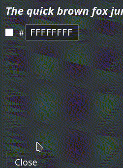

# ZtWidgets
A collection of custom Qt widgets with focus on usability

## Color Picker
ColorPicker is a compact, expandible color picker allowing for quick edits of a QColor property without reflowing the parent widget.

## Editable Slider
SliderEdit is a slider widget with quick edit capabilities, shortcut support, and customizable display text.

